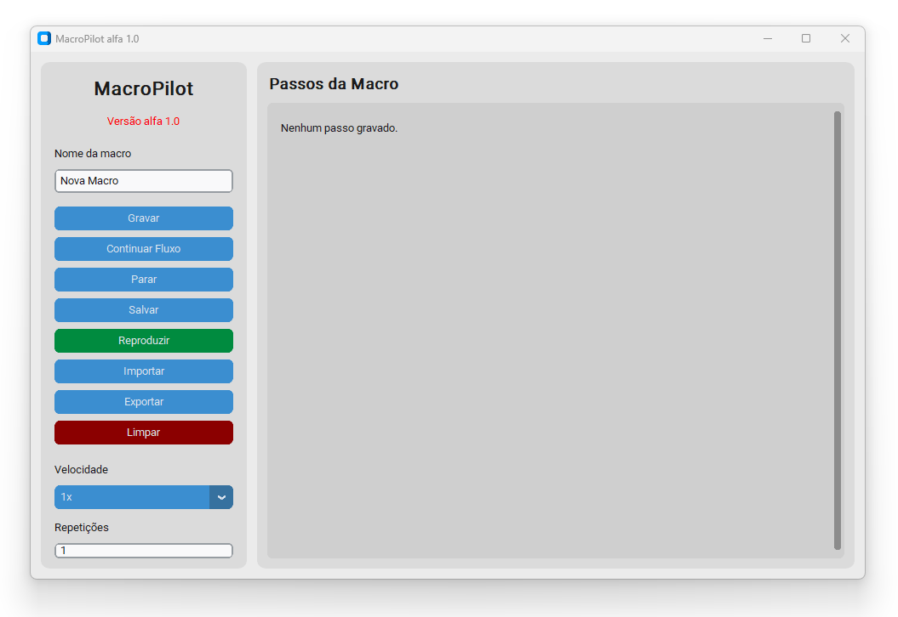

# MacroPilot
Este projeto é um utilitário simples para automação de tarefas repetitivas, funcionando como uma macro de tela fácil de usar. Ele permite criar e gerenciar várias macros, que podem ser salvas e carregadas em arquivos `.json`, facilitando a personalização e reutilização dos fluxos de trabalho.

## Instalação

<p align="center">
    
</p>

1. Clone o repositório:
    ```
    git clone https://wrkcoronel/macropilot.git
    ```
2. Navegue até o diretório do projeto:
    ```
    cd macropilot
    ```
3. Para instalar, basta rodar o script `build_exe.bat`:
    ```
    build_exe.bat
    ```
   Isso irá gerar um executável `.exe` na pasta `dist`.
